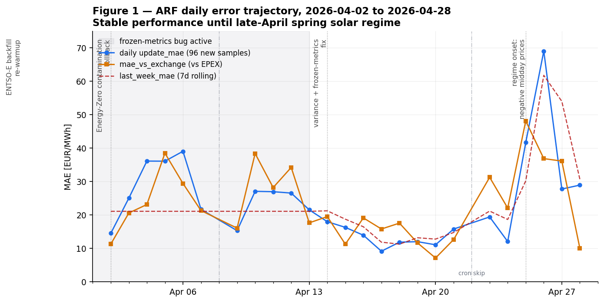
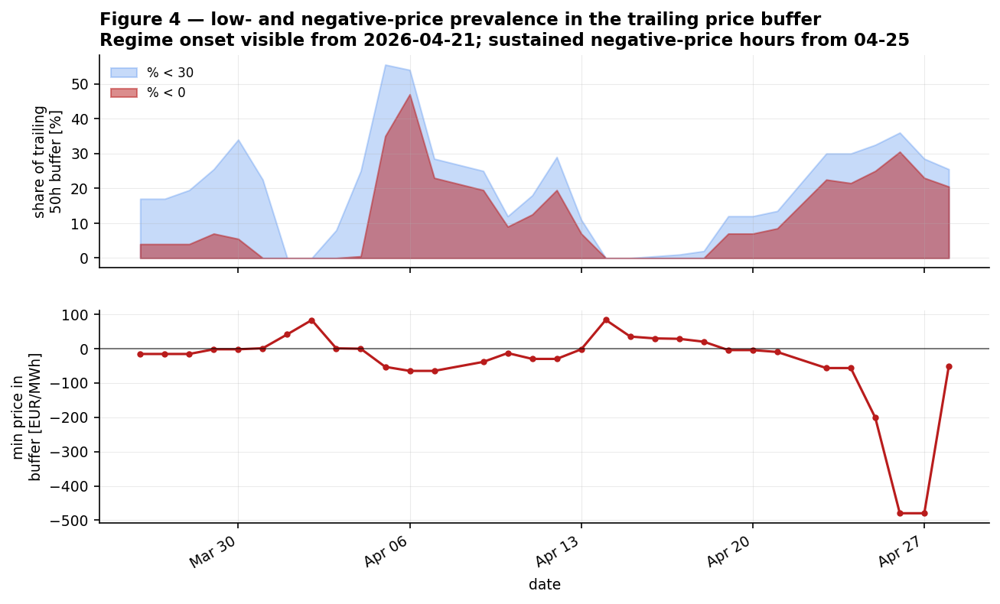
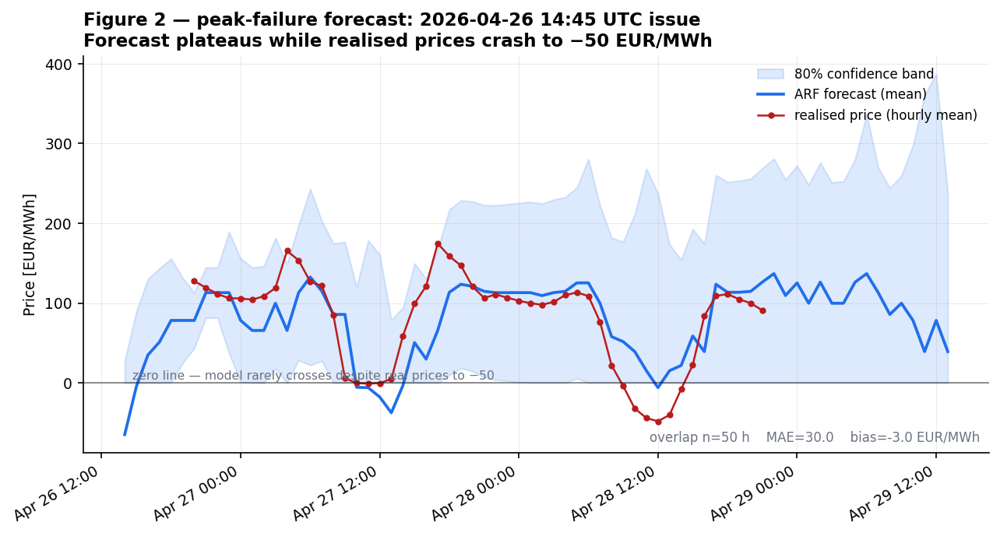
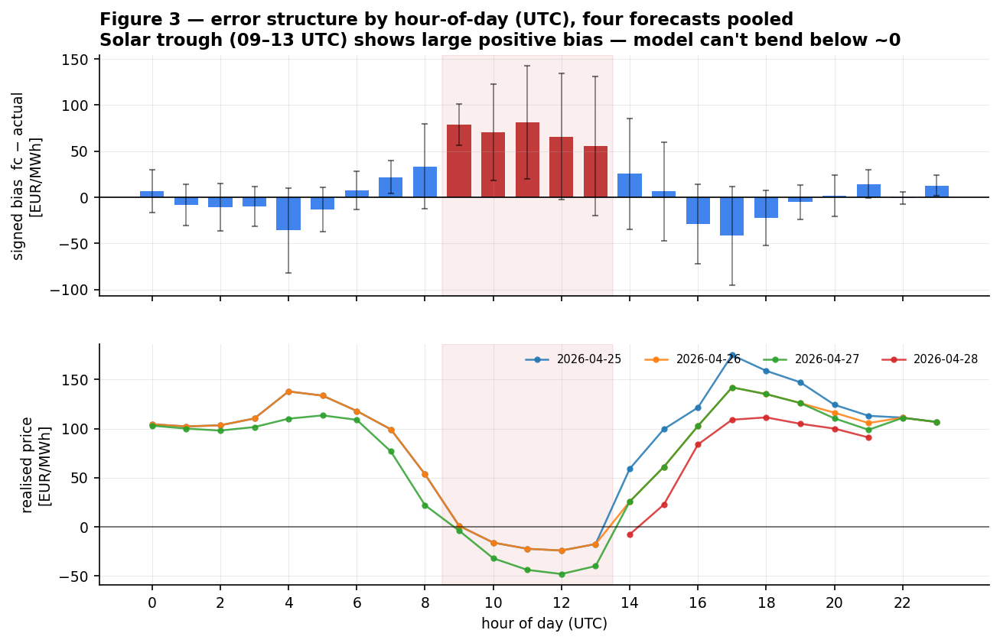
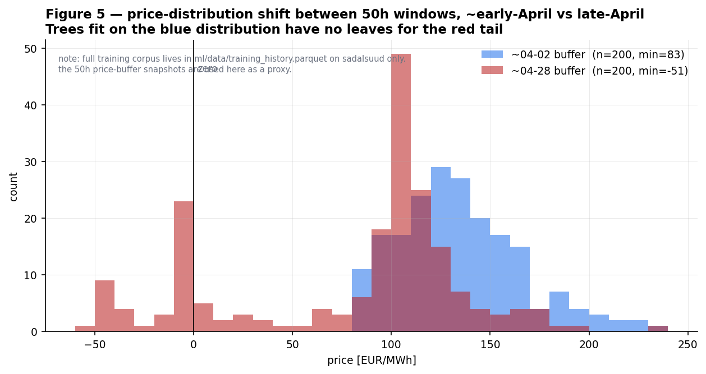

# River ARF — End of Run

**Status**: retired
**Run window**: 2026-03-26 → 2026-04-28 (33 calendar days of daily updates as the
production model; preceded by warmup work earlier in the repo's history).
**Replacement**: LightGBM with quantile loss, retrained nightly on a rolling window
(plan to be drafted as a separate document; not yet deployed).

This is a neutral postmortem. The model did the job it was scoped to do until the
underlying price regime moved outside its training distribution. The retirement
decision is structural, not a complaint about implementation.

## 1. What ARF was meant to do

ADR-004 (`docs/decisions/004-river-online-learning-architecture.md`) chose the
[River](https://riverml.xyz) `ARFRegressor` (Adaptive Random Forest, 10 trees) for
three reasons that all held up:

1. **Online learning**, no retraining infrastructure. `learn_one` on each new
   quarter-hourly price kept the model current without a CI pipeline or batch
   trigger.
2. **No GPU, no cluster, single-host deploy.** The model lives in a single
   `river_model.pkl` and a `state.json`. Daily cron on one Tailscale node.
3. **Tree ensembles handle non-linearity and feature interactions** without
   manual feature engineering for crosses.

Targets at MVP scope: continuous learning of NL day-ahead wholesale price
(EUR/MWh) on a 72-hour horizon, with confidence bands derived from a running
EWM of recent errors.

## 2. Trajectory

The April record is what survives in git. From 2026-04-02 through 2026-04-21 the
daily `update_mae` ran in the 11–25 EUR/MWh band — broadly in line with the
warmup-era baseline of 13.80 EUR/MWh — interrupted by two operational incidents
that were diagnosed and patched in-place:

- **2026-04-02** — Energy-Zero contamination rollback. With the ENTSO-E collector
  upstream silently absent for ~5 days, `parse_price_file()` was falling through
  to Energy-Zero consumer prices (incl. VAT and surcharge) as the training
  target. Fix: removed the consumer source from the wholesale merge, rolled
  model back to a pre-contamination checkpoint, learn forward. (`memory/gotcha-log.md`)
- **2026-04-14** — Forecast collapse + frozen metrics. Recursive lag feeding plus
  MSE tree splits compressed the 72h forecast to a near-flat mean (range
  24 EUR/MWh). Separately, `mae` and `last_week_mae` were being *copied* from
  state instead of recomputed, so the degradation was invisible on the
  dashboard. Both fixed in `ml/update.py`. The shaded band in Figure 1 is the
  period during which `mae` was stuck at 13.80; it unfreezes on 2026-04-14.
  (`docs/model-progress-log.md#2026-04-14-fix`)

Two cron skips appear as gaps: 2026-04-08 (cause unknown, no trace in logs) and
2026-04-22 (transient DNS failure pulling energyDataHub: `Could not resolve host:
github.com`). Neither materially affected the trajectory.

The error trajectory then breaks decisively in the last week. From 2026-04-23
onward, `update_mae` climbs to 41.68 (04-25) and **69.05 on 04-26**, with the
EWM error standard deviation reaching **104.05 EUR/MWh** — almost 4× the running
norm. By 04-28 the headline `mae` (rolling 500 errors) reads 35.58 EUR/MWh,
roughly 3× the post-warmup baseline.

## 3. The regime shift

Figure 4 puts the operational record in market context. The trailing 50-hour
price buffer in each daily snapshot shows the share of quarter-hourly prices
below zero. Through April this stays mostly under 10%, with brief excursions in
the first week of April (Easter weekend low load + decent solar). From
2026-04-21 the share climbs above 20% and stays there. The minimum price in the
buffer drops below −400 EUR/MWh in two snapshots — sustained, not isolated,
solar-curtailment-driven negative settlement.

This is the first time the model has had to forecast through a high-share
negative-price regime. The training corpus, banked at warmup on 2026-03-28
(`ml/data/training_history.parquet`, 4 192 hourly samples spanning roughly the
preceding winter), does not contain comparable structure: deep midday troughs,
sharp evening recoveries, and a price floor well below zero.

## 4. The structural failure

Figure 2 shows the 72-hour forecast issued at 2026-04-26 14:45 UTC against the
hourly-averaged realised price recovered from the 04-28 state's `price_buffer`
(50h overlap). The forecast does dip negative very early — that segment uses
known exchange day-ahead prices as lag inputs — but past hour h+9, when the
model has to operate on its own predicted lags, the central line flattens
between roughly +50 and +120 EUR/MWh. Realised prices in that window drop into
the −40s on two consecutive midday troughs.

The pattern is not a coincidence. Aggregating across the four recovered
forecasts (04-25 → 04-28):

Errors are concentrated in **09–13 UTC**, the solar peak hours. Across the four
forecasts the model overpredicts by 55–80 EUR/MWh in those hours, while real
prices have a mean of −20 to −30 EUR/MWh in that same window (lower panel). The
sign is consistent: the model cannot bend down through the trough. There is a
secondary, smaller miss in the 16–18 UTC evening recovery where the model now
underpredicts the rebound — a classic symptom of a learner whose midday and
evening cells have collapsed into one another after the trough hours fall
outside its trained range.

The proximate cause is geometric. `ARFRegressor` predicts the mean of training
samples in the leaf reached by the input. If the training distribution has no
samples in a given `(solar_ghi, hour, load)` cell with a negative price, the
trees have no leaf that returns one. River's online tree-growth heuristic will
eventually split — but at the rate of 96 new samples per day and on a buffer
already ~6 500 samples deep, several weeks of unusual prices would need to
accumulate before the leaf surface has bent. That is not a configuration we can
tune around.

Figure 5 illustrates the same point with the 50-hour price-buffer snapshot from
2026-04-02 (post-rollback baseline) against 2026-04-28. The buffers do not
overlap on the negative side. Trees fit mostly on the blue distribution have no
leaves for the red tail.

A secondary issue compounds this: in `ml/update.py:337` the *lower* confidence
band is hard-clamped at `max(pred − band_width, 0)`. Even when the central
prediction is closer to reality, the uncertainty channel reports that prices
cannot fall below zero. The dashboard band is structurally incompatible with the
new regime. (Patchable in one line, but only meaningful as part of a broader
replacement.)

## 5. Why we are not patching ARF

Three smaller fixes were considered and prototyped on paper but not deployed:

1. Unclamp the lower confidence band (`update.py:337`).
2. Shorten the EWM half-life from 24 h to 12 h so confidence bands recover faster
   from outlier days.
3. Enable an explicit ADWIN drift detector on `ARFRegressor` and re-warmup so
   trees can branch on the new regime.

Items 1 and 2 are cosmetic on this failure — they do not give the trees the
ability to predict negative prices. Item 3 is the substantive option, but it
requires a full re-warmup, and the underlying constraint (trees can only
extrapolate to leaf-mean values they have observed) survives even with drift
detection. We would be tuning the rate of catch-up rather than the ceiling.

Adjacent work — the parked Phase 1 A/B (TTF gas + NL generation-mix lag24h
features, `feat/new-features-ttf-genmix`, EXP-007 in `experiments/registry.jsonl`)
— produced a +1.28 EUR/MWh MAE improvement, below the ≥2 EUR/MWh decision gate.
Even if it had cleared, the gen-mix feature is 24-hour-lagged actuals (the
energyDataHub collector only emits actuals over a `yesterday → today` window),
which captures regime *persistence* but not regime *onset* on a sunny weekend.
Useful, but does not change the structural ceiling.

## 6. What replaces it

The replacement direction is a quantile gradient booster — most likely
LightGBM with pinball loss — retrained nightly on a rolling 4–6 week window.
Three properties matter:

- **Unbounded predictions.** Quantile regression with no clamping outputs
  negative values when the data say so.
- **Native uncertainty.** Pinball loss directly learns the P10/P50/P90, so the
  confidence band is a learned object rather than an EWM bolt-on.
- **Cheap nightly retrain.** Day-ahead price models in the wholesale-market
  literature converge on this pattern (GEFCom-style, EPEX-style); the project
  size is well within reach of a single-host nightly job, and the existing
  energyDataHub parquet pipeline can feed it directly.

The plan is to run the new model in **shadow mode** alongside ARF on the daily
cron for at least two weeks. Promotion criteria, in priority order: (a) better
MAE specifically on hours where realised price < 30 EUR/MWh, (b) better
calibration of P10/P90 vs realised quantile coverage, (c) no regression on the
high-load evening peak hours. Full plan with concrete thresholds and milestones
in [`docs/lightgbm-quantile-shadow-plan.md`](lightgbm-quantile-shadow-plan.md).

ARF will keep running until that bar is met. The infrastructure (daily cron,
encryption, dashboard, archive) was designed model-agnostic and remains
appropriate for any single-pickle replacement.

## 7. Data preserved

All artifacts behind this document live under `docs/figures/arf-retrospective/data/`:

- `metrics_trajectory.csv` — 35 rows, one per `state.json` commit on `origin/main`,
  spanning 2026-03-26 → 2026-04-28. Includes recomputed EWM error std using the
  exact `ml/update.py` formula.
- `metrics_history.csv` — 25 daily entries from the embedded `metrics_history`
  array; only source of `mae_vs_exchange` per day.
- `forecast_2026-04-25.json` … `forecast_2026-04-28.json` — daily forecast
  archives pulled from sadalsuud.
- `MANIFEST.md` — what was recovered, what was lost, sources and gaps.

Per-commit `river_model.pkl` snapshots (35 of them) remain in git history and
can be reloaded individually with `git show <hash>:ml/models/river_model.pkl`.
The training parquet (`ml/data/training_history.parquet`, 101 739 bytes,
mtime 2026-03-28) lives only on sadalsuud and should be pulled to local before
the model is fully decommissioned.

The full lifecycle log including the warmup, the rollback, the forecast fix,
the long-history probe, the Phase 1 A/B, and this retirement decision is
back-filled in `experiments/registry.jsonl` (EXP-001 through EXP-008).
